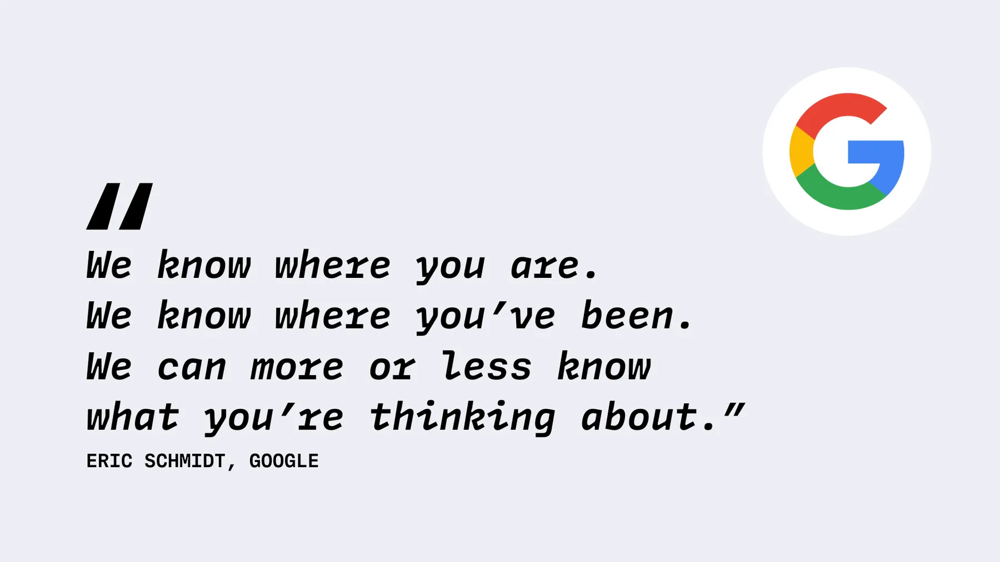
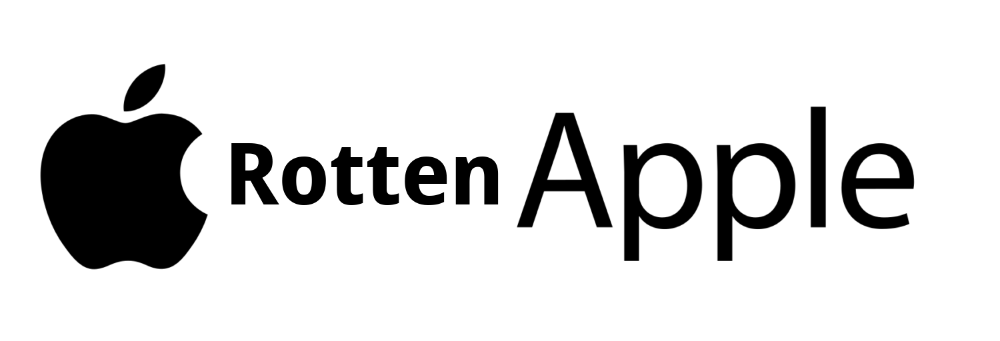
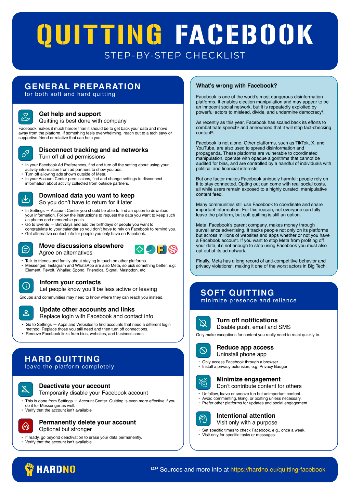

## IsHacker

<!--
**IsHacker003/IsHacker003** is a ✨ _special_ ✨ repository because its `README.md` (this file) appears on your GitHub profile.

Here are some ideas to get you started:

- 🔭 I’m currently working on ...
- 🌱 I’m currently learning ...
- 👯 I’m looking to collaborate on ...
- 🤔 I’m looking for help with ...
- 💬 Ask me about ...
- 📫 How to reach me: ...
- 😄 Pronouns: ...
- ⚡ Fun fact: ...
-->
</img>
**Free software means that the users have the freedom to run, edit, contribute to, and share the software. Thus, free software is a matter of liberty, not price.**

# My thoughts on the GAFAM
## Google
Google's proprietary Android apps not only invade your privacy by collecting your data non-stop and "selling" it (they do sell it, it's just that they don't want to confess), their apps also drain battery like crazy and slow down your device by *a lot*. Google play store and Google play services contain universal backdoors, through which Google (and probably other people too) can forcibly remove and install apps. The new APK sideloading block (coming in 2026) will also be implemented through this backdoor. They also have their ad network, DoubleClick, which tracks you accross the web.
</img>
## Apple
I personally call them "RottenApple". iOS and MacOS are proprietary operating systems, and they are **jails**. They lock you in to their walled garden, and enforce DRM. And of course, they also spy on you, just as you would expect from the GAFAM. 

However, my hate towards them is indirect, as I never really owned any RottenApple product.
</img>
## Facebook
I honesly have no words to describe the horrible actions commited by Facebook/Meta. Just know that, if you are using any Facebook program(s) (which include the Facebook app, Whatsapp, Instagram, Threads, etc.), you **must** quit immediately and uninstall the program(s). Facebook/Meta collects as much data about you as possible, and their tracking doesn't really stop even when you don't have an account or you don't use Facebook's software. To get complete protection, you need to set up a firewall and block every Facebook domain. Recently, Facebook called GNU/Linux as "malware", although their own servers run on GNU/Linux. This makes them ungrateful as well.
</img>
