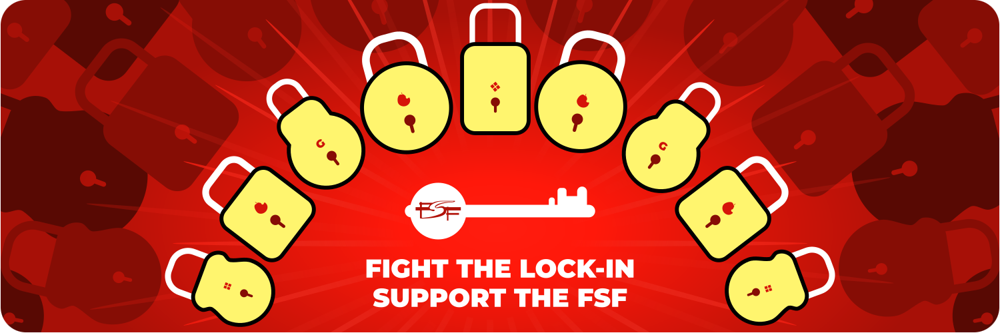

## IsHacker

<!--
**IsHacker003/IsHacker003** is a ✨ _special_ ✨ repository because its `README.md` (this file) appears on your GitHub profile.

Here are some ideas to get you started:

- 🔭 I’m currently working on ...
- 🌱 I’m currently learning ...
- 👯 I’m looking to collaborate on ...
- 🤔 I’m looking for help with ...
- 💬 Ask me about ...
- 📫 How to reach me: ...
- 😄 Pronouns: ...
- ⚡ Fun fact: ...
-->
</img>
**Free software means that the users have the freedom to run, edit, contribute to, and share the software. Thus, free software is a matter of liberty, not price.**

# My thoughts on the GAFAM
## Google
Google's proprietary Android apps not only invade your privacy by collecting your data non-stop and "selling" it (they do sell it, it's just that they don't want to confess), their apps also drain battery like crazy and slow down your device by *a lot*. Google play store and Google play services contain universal backdoors, through which Google (and probably other people too) can forcibly remove and install apps. The new APK sideloading block (coming in 2026) will also be implemented through this backdoor. This also makes their apps **trojan horses**, as they pretend to be useful, but in reality they are malicious (that's the definition of a trojan). 

They also have their ad network, DoubleClick, which tracks you accross the web.
</img>
## Apple
I personally call them "RottenApple". iOS and MacOS are proprietary operating systems, and they are **jails**. They lock you in to their walled garden, and enforce DRM. And of course, they also spy on you, just as you would expect from the GAFAM. 

However, my hate towards them is indirect, as I never really owned any RottenApple product.
</img>
## Facebook
I honesly have no words to describe the horrible actions commited by Facebook/Meta. Just know that, if you are using any Facebook program(s) (which include the Facebook app, Whatsapp, Instagram, Threads, etc.), you **must** quit immediately and uninstall the program(s). Facebook/Meta collects as much data about you as possible, and their tracking doesn't really stop even when you don't have an account or you don't use Facebook's software. To get complete protection, you need to set up a firewall and block every Facebook domain. Recently, Facebook called GNU/Linux as "malware", although their own servers run on GNU/Linux. This makes them ungrateful as well.
</img>
## Amazon
Amazon is famous for the Swindle ("Kindle") Ebook reader, which is full of universal backdoors. It also imposes DRM. In fact, one of the reasons Amazon is famous for is DRM. And of course, they too spy on you for ad (re)targeting and other marketing purposes.

Devices like the Echo and Alexa are listening 24x7, and Amazon keeps these recordings for *years*.

</img>
## Microsoft
Also called "Microshit". They are famous for their proprietary "Operating System", Windows. Windows contains a ton of malicious functionalities: spyware, adware, DRM, backdoors, etc.

**Spying**

Windows collects a huge amount of data about you. It includes your precise geolocation, your files, what programs are installed, how often you open a program, registry values (which can contain sensitive information like passwords and credit card numbers), and if a microphone is available, it will listen to you all the time. Their e-mail service, Outlook, has become a [data collection and ad delivery service](https://proton.me/blog/outlook-is-microsofts-new-data-collection-service).

The Windows Recall spyware is also being forced onto users since Windows 11 24H2, which records *everything* you do on the computer.

All of these kinds of spying also drastically reduce the performance of the computer.

**Bloat/adware**

Windows contains a lot of bloatware by default, which are always proprietary software. Some of them are also installed by the OEM. The start menu (and more recently the BSOD screen) contain ads and promotions.

**Backdoors**

Windows has a universal backdoor, through which any change whatsoever can be imposed. Microsoft has also backdoored the disk encryption, so they have your BitLocker encryption key.

**DRM**

Windows constantly promotes and enforces DRM. Other members of the GAFAM (such as Google, for their Widevine DRM) impose DRM too, but I have not bothered to mention them in their sections as the DRM is easily removable from their operating systems (for example, DRM can be removed from Android just by installing a single Magisk module).

But it's different for Windows. Windows contains the Widevine and PlayReady DRM by default. Even if you remove all DRM-related files from the OS, DRM will *not* get removed completely, and it will break several things (like Windows updates).

There was also a proprietary program, Microsoft Silverlight, which imposed DRM.

**Miscellaneous**

Another thing which personally bothers me is that Windows costs money. Though it is not related to the idealism of FLOSS, I strongly believe that an Operating System, which is the core of the computer, should be available gratis. Yes, there are FLOSS "Windows activators" out there, but those don't make the situation any less bad.

</img>

*I hereby license this text under Creative Commons Zero 1.0 Universal, and release it into the public domain without any copyright restrictions.*
